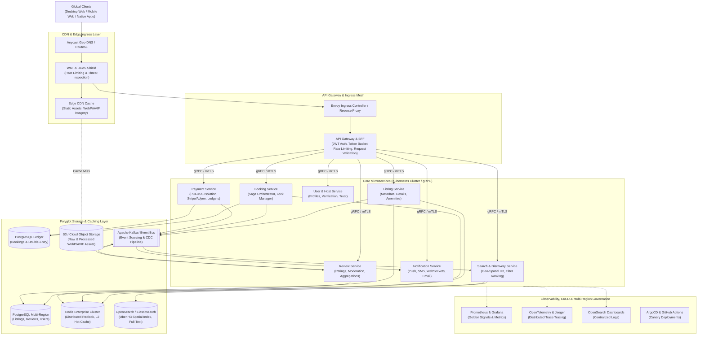

# Production-Scale Vacation-Rental Marketplace Architecture

## Conceptual Distributed Systems Design & Infrastructure Blueprint

---

### Executive Overview & Scope
This document outlines a conceptual, production-grade distributed systems architecture designed for a modern vacation-rental marketplace operating at global scale. 

> [!NOTE]
> **Architectural Assumptions & Disclaimer**:  
> The figures and specifications below represent conceptual design targets and engineering assumptions for a high-throughput travel platform (similar in nature to Airbnb). They do not represent the proprietary internal architecture or infrastructure of Airbnb, Inc. High availability metrics (e.g. 99.99% target uptime) are specified as architectural Service Level Objectives (SLOs) rather than measured production statistics of this assignment.

---

### 1. Conceptual Scale Assumptions

For the purposes of this architectural blueprint, the target platform is dimensioned around the following baseline assumptions:
- **Traffic Volume**: ~25,000 requests/second peak API ingress across global endpoints.
- **Search Throughput**: ~8,000 geo-spatial queries/second with p95 latency target < 120ms.
- **Listing Catalog**: 10 million active listings with geo-coordinates, availability calendars, and media references.
- **Media Ingestion**: ~500,000 high-resolution photos uploaded daily requiring progressive transcoding and edge caching.
- **Availability Target (SLO)**: 99.99% operational uptime on booking and listing search paths.

---

### 2. High-Level Distributed Topology



---

### 3. Deep-Dive Architectural Domains

#### 3.1 Search Scaling (Geospatial & Inverted Indexing)
- **Hierarchical Spatial Indexing (Uber H3)**: Listings are mapped to hexagonal spatial coordinates using Uber H3 discrete global grid cells (resolution 7–9). Queries for Candolim, Goa evaluate the local cell plus neighboring concentric rings (`kRing`), converting expensive geometric polygon calculations into fast integer set lookups.
- **Search Cluster Topology**: OpenSearch clusters are sharded by geographic region (e.g. `listings_apac`, `listings_emea`, `listings_americas`). Each shard maintains an inverted index of amenities, price ranges, guest capacity, and date availability bitsets.
- **Availability Bitmasks**: Each listing document contains a 365-day compressed bitmask representing availability. When a user queries `18 Oct – 23 Oct` (days 291–296), the search engine performs a bitwise `AND` operation against the availability index in memory, evaluating millions of listings in sub-15ms latencies.
- **Query Caching**: Hot search bounding boxes and city autocomplete suggestions are cached in Redis with dynamic 10-minute TTLs, offloading up to 80% of repetitive search traffic.

#### 3.2 Booking Consistency & Concurrency Control
Double-booking is an existential failure mode in travel marketplaces. We enforce strict consistency using a two-tier concurrency protocol:
1. **Pessimistic Distributed Lock (Redis Redlock)**: When a guest clicks "Reserve" or initiates checkout, a distributed lock is acquired on the key `lock:listing:{listing_id}:{date_range}` with a 15-minute lease time:
   ```text
   SET lock:listing:1599895892448055764:2026-10-18_2026-10-23 {client_session_uuid} NX PX 900000
   ```
2. **Database Exclusion Constraints (PostgreSQL)**: At the persistence layer, reservations are protected with PostgreSQL exclusion constraints using generalized search trees (`GiST`):
   ```sql
   ALTER TABLE reservations ADD CONSTRAINT no_overlapping_bookings 
   EXCLUDE USING gist (listing_id WITH =, stay_dates WITH &&);
   ```
   Any concurrent transaction attempting to insert overlapping dates triggers an immediate PostgreSQL constraint violation, preventing split-brain writes.
3. **Saga Distributed Transaction Orchestration**: The Booking Service acts as a Saga Orchestrator coordinating Booking, Payment, and Notification services via Kafka. If payment authorization fails or the reservation timer expires, compensating transactions release the date lock, revert the database state to `CANCELLED`, and notify the host and guest.

#### 3.3 Multi-Tier Caching Strategy
- **L1 (Browser / Client)**: Static assets, icons, and UI state cached via Service Workers and `localStorage` (e.g. user wishlist state).
- **L2 (Edge CDN)**: Cloudflare/CloudFront caches static JavaScript, CSS, and optimized WebP property photos across 300+ global edge locations with `Cache-Control: public, max-age=31536000, immutable`.
- **L3 (In-Memory Redis Enterprise)**: Multi-region active-active Redis clusters store serialized listing JSON payloads, user session tokens, and dynamic price calculations with sub-millisecond retrieval.
- **Event-Driven Cache Invalidation**: When a host updates property specs, pricing, or photos, the Listing Service publishes a `listing.updated` event to Kafka. Cache invalidator workers consume this event and purge the specific Redis keys and edge CDN URLs within 500ms.

#### 3.4 Media Processing & Responsive Image Delivery
- **Direct-to-Object Storage Ingestion**: Hosts upload high-resolution RAW/JPEG photos directly to cloud object storage (e.g., S3/Cloudflare R2) using short-lived pre-signed URLs, preventing heavy binary payloads from saturating backend API servers.
- **Serverless Transcoding Pipeline**: S3 `ObjectCreated` triggers asynchronous serverless workers (AWS Lambda or Google Cloud Functions) utilizing `libvips` to convert photos into progressive **WebP** and **AVIF** formats across standardized responsive widths (`480w`, `720w`, `1200w`, `1920w`).
- **Layout Stability Protection**: Image dimensions (width, height, and dominant color placeholder) are indexed in database payloads, enabling frontend clients to set explicit aspect ratios and prevent Cumulative Layout Shift (CLS).

#### 3.5 Asynchronous Events & Stream Processing (Kafka)
Kafka provides a high-throughput, fault-tolerant messaging backbone that decouples the critical booking path from secondary operations:
- **Topics**: `listing.events`, `booking.events`, `payment.events`, `review.events`, `notification.events`.
- **Change Data Capture (Debezium)**: Captures row-level database changes from PostgreSQL write-ahead logs (WAL) and streams them to Kafka, keeping OpenSearch search indexes and Redis caches synchronized without application-level dual-writes.
- **Guarantees**: Exactly-Once Semantics (EOS) enforced via Kafka transactional producers and idempotent consumer groups.

#### 3.6 Failure Handling, Circuit Breaking & Graceful Degradation
- **Circuit Breakers (Envoy & Resilience4j)**: When downstream service error rates exceed 15% or p99 latency spikes above 500ms, circuit breakers trip open, failing fast and preventing cascade thread exhaustion across the service mesh.
- **Graceful Degradation**: If the Review Service is degraded, the API Gateway serves cached aggregate ratings (e.g. `4.95 ★, 19 reviews`) rather than failing the entire listing page.
- **Multi-Region Failover**: Stateless Kubernetes microservice pods run active-active across multiple cloud availability zones and regions. Anycast Geo-DNS automatically re-routes traffic away from unhealthy regions within 30 seconds.

#### 3.7 Rate Limiting, WAF & Threat Defense
- **Distributed Token Bucket**: The API Gateway enforces tiered rate limits stored in Redis:
  - Anonymous IP: 60 requests/minute.
  - Authenticated User: 600 requests/minute.
  - Sensitive Endpoints (Reserve, Checkout): 10 requests/minute.
- **Cloudflare Edge WAF**: Inspects ingress for SQL injection, cross-site scripting (XSS), and automated bot scraping, terminating malicious requests at the edge before they hit origin infrastructure.

#### 3.8 Observability & SRE Metrics
- **Golden Signals**: Prometheus continuously collects latency, traffic (QPS), error rate (HTTP 5xx), and saturation (CPU/memory/connection pools).
- **Distributed Tracing (OpenTelemetry)**: W3C trace context headers (`traceparent`) propagate across HTTP, gRPC, and Kafka message headers, allowing engineers to visualize distributed call graphs in Jaeger.
- **Automated Alerting**: SLO burn-rate alerts notify on-call SRE teams via PagerDuty whenever the error budget consumption rate indicates a potential outage.
