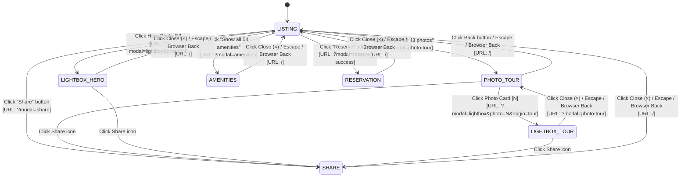

# Application State Machine & Transition Model

## PlayPower Labs Airbnb Listing Take-Home Assessment
**Architecture Pattern**: Deterministic Finite State Machine (FSM) with Bidirectional URL History Synchronization  
**State Manager**: Native React 18 Hooks + `window.history` Push/PopState

---

### 1. High-Level State Transition Diagram

---

### 2. Formal Transition Matrix

| Current State (`activeModal`) | Input Event / Trigger | Guard Condition | Next State | URL Query | Focus Action |
| :--- | :--- | :--- | :--- | :--- | :--- |
| **`LISTING`** | `SHOW_ALL_PHOTOS` | None | `PHOTO_TOUR` | `?modal=photo-tour` | Push trigger to stack; focus first modal control |
| **`LISTING`** | `CLICK_HERO_PHOTO(N)` | `0 <= N < 43` | `LIGHTBOX` (`origin='hero'`) | `?modal=lightbox&photo=N` | Push hero tile; focus lightbox stage |
| **`LISTING`** | `OPEN_AMENITIES` | None | `AMENITIES` | `?modal=amenities` | Push trigger; focus modal close button |
| **`LISTING`** | `OPEN_SHARE` | None | `SHARE` | `?modal=share` | Push trigger; focus copy link button |
| **`LISTING`** | `CLICK_RESERVE` | Valid dates & capacity | `RESERVATION` | `?modal=reserve-success` | Push reserve button; focus modal dialog |
| **`PHOTO_TOUR`** | `CLICK_TOUR_PHOTO(N)` | `0 <= N < 43` | `LIGHTBOX` (`origin='tour'`) | `?modal=lightbox&photo=N&origin=tour` | Push photo card; focus lightbox stage |
| **`PHOTO_TOUR`** | `CLOSE_MODAL` / `Escape` | None | `LISTING` | `/` | Pop trigger; restore focus to "Show all photos" |
| **`PHOTO_TOUR`** | `OPEN_SHARE` | None | `SHARE` | `?modal=share` | Push share button; focus share dialog |
| **`LIGHTBOX` (`hero`)** | `CLOSE_MODAL` / `Escape` | Origin is `'hero'` | `LISTING` | `/` | Pop trigger; restore focus to originating hero tile |
| **`LIGHTBOX` (`tour`)** | `CLOSE_MODAL` / `Escape` | Origin is `'tour'` | `PHOTO_TOUR` | `?modal=photo-tour` | Pop trigger; restore focus to originating photo card |
| **`LIGHTBOX`** | `NEXT_PHOTO` | `photoIndex < 42` | `LIGHTBOX` (index `N+1`) | `?modal=lightbox&photo=N+1` | Maintain focus on next button / stage |
| **`LIGHTBOX`** | `PREV_PHOTO` | `photoIndex > 0` | `LIGHTBOX` (index `N-1`) | `?modal=lightbox&photo=N-1` | Maintain focus on prev button / stage |
| **`AMENITIES`** | `CLOSE_MODAL` / `Escape` | None | `LISTING` | `/` | Pop trigger; restore focus to "Show all 54" |
| **`SHARE`** | `CLOSE_MODAL` / `Escape` | None | Previous state (`LISTING` or `TOUR`) | Previous URL | Pop trigger; restore focus to share button |
| **`RESERVATION`** | `CLOSE_MODAL` / `Escape` | None | `LISTING` | `/` | Pop trigger; restore focus to reserve button |

---

### 3. Error Handling & Boundary Clamping Invariants

| Failure Mode / Edge Case | System Behavior | Recovery Mechanism | Tested In |
| :--- | :--- | :--- | :--- |
| **Malformed URL Query** (`?modal=invalid_string`) | Ignored silently | Defaults to `LISTING` (`modal: 'none'`); no crash | `integration.test.js` Suite 1 |
| **Negative Photo Index** (`?modal=lightbox&photo=-15`) | Clamped to valid range | Clamped to index `0`; renders first photo | `integration.test.js` Suite 1 |
| **Overflow Photo Index** (`?modal=lightbox&photo=999`) | Clamped to upper bound | Clamped to index `42`; renders last photo | `integration.test.js` Suite 1 |
| **Non-Numeric Photo Parameter** (`?photo=abc`) | NaN guard | Fallback to index `0` | `integration.test.js` Suite 1 |
| **Corrupted Wishlist Storage** (Invalid JSON in `localStorage`) | Catches parse exception | Falls back to default `false` state | `listing.test.js` Suite 5 |
| **Missing Image Asset** (404 on local WebP) | `onError` event listener | Triggers automatic switch to remote CDN fallback URL | `listing.test.js` Suite 8 |
| **Guest Exceedance** (Guest count > 3) | Bound check in stepper | Blocks incrementing beyond 3 total guests | `listing.test.js` Suite 3 |
| **Adult Underflow** (0 adults) | Stepper constraint | Prevents decrementing adults below 1 | `listing.test.js` Suite 3 |
| **Inverted Date Selection** (Checkout <= Checkin) | Validation guard | Rejects checkout dates before checkin | `listing.test.js` Suite 2 |
