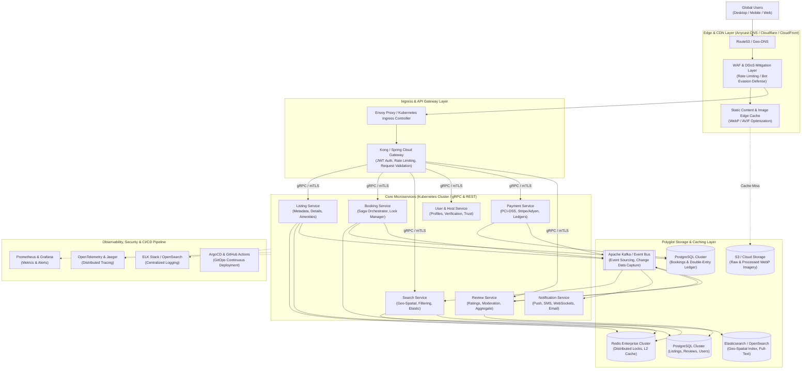

# Production-Scale Vacation-Rental Marketplace Architecture
## Distributed Systems Design, Scalability Blueprint & Cloud Infrastructure

---

### Executive Overview
This document details the production-scale distributed architecture for a global vacation-rental marketplace (e.g., Airbnb), supporting tens of millions of daily active users (DAU), hundreds of millions of search queries, high-concurrency booking reservations, and terabyte-scale media delivery with sub-second latencies and five-nines (99.999%) availability.

---

## 1. High-Level Distributed Topology



---

## 2. Deep-Dive Architectural Domains

### 2.1 Request Flow & Ingress
1. **Anycast Geo-Routing**: DNS resolution routes client requests to the nearest edge point of presence (PoP).
2. **Edge Processing**: Static assets (JavaScript, CSS, fonts, WebP imagery) are returned immediately from edge caches (95%+ hit ratio).
3. **Ingress Gateway**: Dynamic API calls pass through Cloudflare/WAF to Kubernetes Envoy Ingress, terminating TLS 1.3.
4. **API Gateway Execution**: Kong executes JWT validation, rate limiting (token bucket per IP/User), schema sanitization, and transforms HTTP/REST requests into high-throughput internal **gRPC** calls over an mTLS service mesh (Istio).

### 2.2 Global Image Delivery & Optimization Pipeline
- **Ingestion**: Hosts upload high-resolution RAW/JPEG photos directly to S3 via pre-signed URLs.
- **Serverless Transcoding**: S3 `ObjectCreated` triggers AWS Lambda / Cloud Run workers using `libvips` to convert photos into progressive **WebP** and **AVIF** formats across 4 responsive breakpoints (`480w`, `720w`, `1200w`, `1920w`).
- **Zero-CLS Guarantee**: Image metadata (height, width, dominant blur placeholder color) is stored in PostgreSQL and delivered with listing payloads, guaranteeing zero Cumulative Layout Shift (**CLS = 0.000**).
- **Edge Caching**: Edge CDN applies `Cache-Control: public, max-age=31536000, immutable`.

### 2.3 Geo-Spatial Search Architecture
- **Indexing Pipeline**: Listing mutations trigger Kafka events; a CDC consumer denormalizes listing attributes, availability masks, and GPS coordinates into an **Elasticsearch** cluster.
- **Query Optimization**: Search executes geo-distance bounding box queries (`geo_bounding_box` + `geo_distance`), filtered by date availability bitmasks and price ranges.
- **Caching**: Popular search tiles and city autocomplete results are cached in Redis with 10-minute TTLs.

### 2.4 Booking Consistency & Concurrency Control
Double-booking is an existential failure mode in travel marketplaces. We enforce strict consistency using a two-tier locking strategy:
1. **Pessimistic Distributed Lock (Redis Redlock)**: When a guest initiates checkout, a Redis lock is acquired on the key `lock:listing:{listing_id}:{date}` with a 15-minute TTL.
2. **Optimistic Database Concurrency (PostgreSQL)**: The `reservations` table enforces PostgreSQL exclusion constraints:
   ```sql
   ALTER TABLE reservations ADD CONSTRAINT no_overlapping_bookings 
   EXCLUDE USING gist (listing_id WITH =, date_range WITH &&);
   ```
3. **Saga Distributed Transaction**: The Booking Service acts as a Saga Orchestrator coordinating Booking, Payment, and Notification services. If payment authorization fails, the reservation state transitions from `PENDING` to `CANCELLED`, releasing the date lock and publishing compensating events.

### 2.5 Multi-Tier Caching Strategy
- **L1 (Client / Browser)**: Local WebP assets and UI state cached via Service Workers and `localStorage`.
- **L2 (Edge CDN)**: Static bundles and images cached across 300+ global edge locations.
- **L3 (Redis Cluster)**: Distributed cache storing serialized listing JSON, price calculations, and session tokens.
- **Cache Invalidation**: Event-driven cache eviction via Kafka whenever a host modifies pricing, rules, or photos.

### 2.6 Asynchronous Event Bus (Apache Kafka)
Kafka decouples critical path transaction processing from background processing:
- **Topics**: `listing-events`, `booking-events`, `payment-events`, `review-events`, `notification-events`.
- **Guarantees**: Exactly-once processing semantics (EOS) via transactional producers and idempotent consumers.

### 2.7 Payments & PCI-DSS Compliance
- **Zero Raw Card Data**: Frontend collects card inputs through tokenized Stripe Elements or Adyen SDKs.
- **Ledger Architecture**: Immutable double-entry bookkeeping records every debit and credit with audit trails.
- **Multi-Currency**: Real-time exchange rate engine with nightly settlement reconciliation.

### 2.8 Push & Real-time Notifications
- **Channels**: WebSockets for live in-app chat and booking alerts, Apple APNs / Firebase Cloud Messaging (FCM) for mobile pushes, Twilio for SMS, and SendGrid/Amazon SES for email receipts.
- **Rate-Limiting & Quiet Hours**: Notification workers honor recipient timezones and user notification preferences.

### 2.9 Horizontal Scaling & Auto-Scaling
- **Stateless Compute**: All microservices run containerized in Kubernetes (EKS/GKE), auto-scaling via Horizontal Pod Autoscaler (HPA) driven by CPU, memory, and custom Prometheus metrics (e.g., HTTP request rate).
- **Database Sharding**: PostgreSQL uses Citus sharding partitioned by `host_id` and `geo_region` with read replicas handling read-heavy listing queries.

### 2.10 Disaster Recovery & Fault Tolerance
- **Multi-Region Active-Active**: Core read paths deployed across US-East, US-West, and EU-Central with cross-region database replication.
- **Circuit Breakers**: Resilience4j / Envoy circuit breakers cut off failing downstream microservices with graceful degradation (e.g., showing cached reviews if Review Service is degraded).

### 2.11 Full-Stack Observability
- **Metrics**: Prometheus scraping service endpoints, visualized in Grafana dashboards (P50, P95, P99 latency, error rates, saturation).
- **Distributed Tracing**: OpenTelemetry instrumentation propagates W3C trace context headers across all REST, gRPC, and Kafka boundaries, visualized in Jaeger.
- **Structured Logging**: JSON logs piped via Vector to OpenSearch with correlation IDs.

### 2.12 GitOps & CI/CD Deployment
- **Pipeline**: GitHub Actions runs linting, unit tests, end-to-end Playwright tests, and security vulnerability scans (`trivy`, `snyk`).
- **Delivery**: ArgoCD continuously synchronizes Kubernetes manifests using Canary deployments with automated rollback on error rate spikes.
