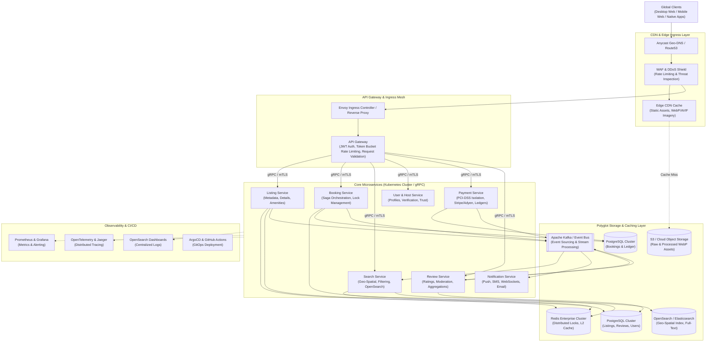

# Production-Scale Vacation-Rental Marketplace Architecture

## Conceptual Distributed Systems Design & Infrastructure Blueprint

---

### Executive Overview & Scope
This document outlines a conceptual, production-grade distributed systems architecture designed for a modern vacation-rental marketplace operating at global scale. 

> [!NOTE]
> **Architectural Assumptions & Disclaimer**:  
> The figures and specifications below represent conceptual design targets and engineering assumptions for a high-throughput travel platform (similar in nature to Airbnb). They do not represent the proprietary internal architecture or infrastructure of Airbnb, Inc. High availability metrics (e.g. 99.99% target uptime) are specified as architectural Service Level Objectives (SLOs) rather than measured production statistics of this assignment.

---

### 1. Conceptual Scale Assumptions

For the purposes of this architectural blueprint, the target platform is dimensioned around the following baseline assumptions:
- **Traffic Volume**: ~25,000 requests/second peak API ingress across global endpoints.
- **Search Throughput**: ~8,000 geo-spatial queries/second with p95 latency target < 120ms.
- **Listing Catalog**: 10 million active listings with geo-coordinates, availability calendars, and media references.
- **Media Ingestion**: ~500,000 high-resolution photos uploaded daily requiring progressive transcoding and edge caching.
- **Availability Target (SLO)**: 99.99% operational uptime on booking and listing search paths.

---

### 2. High-Level Distributed Topology



---

### 3. Deep-Dive Architectural Domains

#### 3.1 Ingress, Routing & Edge Delivery
1. **Anycast Geo-Routing**: Client DNS queries resolve to the topologically nearest point of presence (PoP).
2. **Edge Asset Delivery**: Static bundles (JavaScript, CSS, fonts, WebP imagery) are cached at edge nodes with long TTLs (`Cache-Control: public, max-age=31536000, immutable`), reducing round-trip latency to origin.
3. **WAF & Rate Limiting**: Ingress checks incoming traffic for anomalous patterns, bot signatures, and volumetric floods before routing clean requests to origin ingress.
4. **API Gateway Execution**: The gateway validates JWT signatures, enforces client rate limits via Redis token-bucket algorithms, and dispatches requests to downstream microservices using internal gRPC over an mTLS service mesh (Istio).

#### 3.2 Media Processing & Responsive Image Pipeline
- **Host Uploads**: Hosts upload raw image files directly to cloud object storage (e.g., S3/GCS) using short-lived pre-signed URLs, keeping large binary payloads off application web servers.
- **Asynchronous Transcoding**: Object creation triggers serverless worker jobs (AWS Lambda or Google Cloud Functions) utilizing `libvips` to generate optimized WebP and AVIF variants across four standardized responsive widths (`480w`, `720w`, `1200w`, `1920w`).
- **Layout Stability**: Fixed dimensions (width, height, aspect ratio) are indexed in database payloads, enabling frontend clients to reserve layout space and minimize Cumulative Layout Shift.

#### 3.3 Geo-Spatial Search Architecture
- **Search Index**: OpenSearch/Elasticsearch clusters maintain indexed listing documents containing geo-points, nightly rates, amenities bitmasks, and calendar availability windows.
- **Sync Pipeline**: Database writes publish Change Data Capture (CDC) events to Kafka, allowing search ingestion workers to denormalize and index listing state asynchronously.
- **Query Strategy**: Compound queries combine geo-bounding-box spatial filters with availability ranges and category facets, while hot geographic regions are cached in Redis with short expiration times.

#### 3.4 Booking Consistency & Concurrency Control
Double-booking is prevented using a layered concurrency strategy:
1. **Pessimistic Distributed Lock (Redis Redlock)**: When a guest enters checkout, a distributed lock is acquired on `lock:listing:{listing_id}:{date_range}` with a 15-minute lease time.
2. **Database Exclusion Constraints (PostgreSQL)**: At the persistence tier, reservations are protected with PostgreSQL exclusion constraints preventing temporal overlaps:
   ```sql
   ALTER TABLE reservations ADD CONSTRAINT no_overlapping_bookings 
   EXCLUDE USING gist (listing_id WITH =, date_range WITH &&);
   ```
3. **Saga Orchestrator Pattern**: A Saga coordinator manages the distributed transaction across Booking, Payment, and Notification services. If payment authorization fails or expires, the reservation state transitions from `PENDING` to `CANCELLED`, releasing the dates and publishing compensating rollback events.

#### 3.5 Asynchronous Event Bus (Apache Kafka)
Kafka acts as the central messaging backbone decoupling read and write paths:
- **Topics**: `listing-events`, `booking-events`, `payment-events`, `review-events`, `notification-events`.
- **Consumer Isolation**: Notifications, search indexers, and analytical data pipelines consume events independently without imposing synchronous overhead on primary checkout paths.

#### 3.6 Payments & Security Boundaries
- **PCI-DSS Isolation**: Frontend clients tokenize payment credentials directly through third-party gateways (e.g. Stripe, Adyen). No raw credit card data traverses internal application servers.
- **Financial Ledger**: Double-entry ledger architecture records debit and credit transactions with cryptographic hash validation to maintain auditable accounting trails.

#### 3.7 Observability & Reliability Engineering
- **Metrics & Alerting**: Prometheus scrapes service telemetry, tracking golden signals (latency, traffic, errors, saturation) with alerts routed to PagerDuty.
- **Distributed Tracing**: OpenTelemetry trace context headers propagate through gRPC and Kafka calls to visualize end-to-end request lifecycles in Jaeger.
- **Graceful Degradation**: Circuit breakers (e.g., Resilience4j) isolate non-critical dependencies (e.g., showing cached review summaries if the Review Service experiences elevated latency).

#### 3.8 CI/CD & Deployment
- **GitOps Pipeline**: Source changes trigger automated linting, unit tests, and security scans in GitHub Actions.
- **Canary Deployments**: ArgoCD executes automated progressive rollouts to Kubernetes clusters, monitoring latency and error rate metrics with automatic rollback capabilities.
